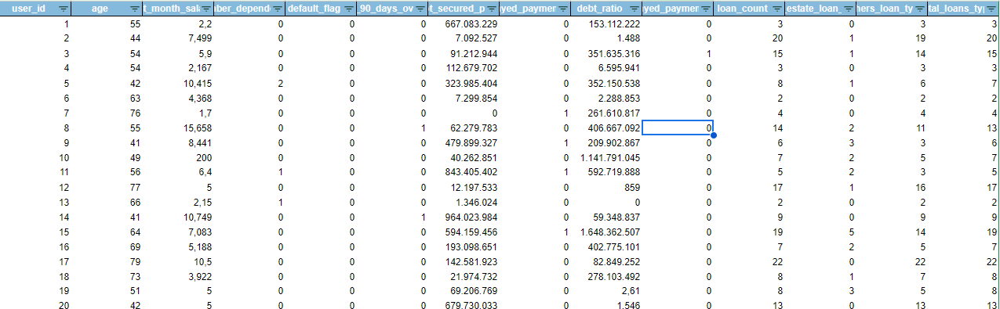
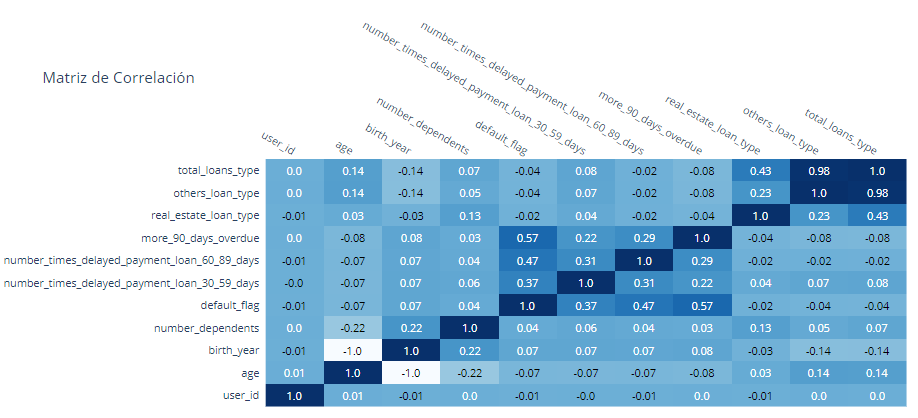
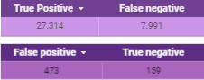
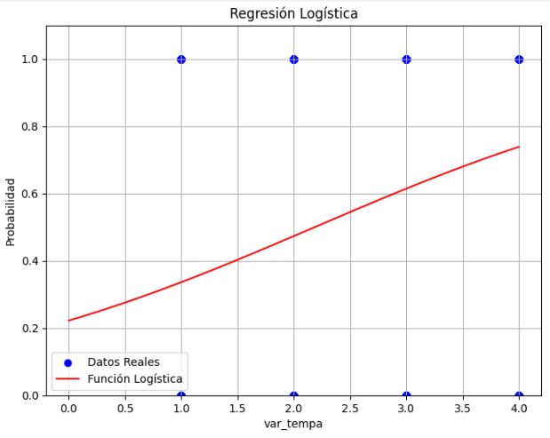

# Proyecto3_Riesgo_relativo
Propuesta de automatización del proceso de análisis utilizando técnicas avanzadas de análisis de datos, con el objetivo de mejorar la eficiencia, la precisión y la rapidez en la evaluación de las solicitudes de crédito.
# Temas
- [Introducción](#introducción)
- [Herramientas](#herramientas)
- [Lenguajes](#lenguajes)
- [Procesamiento y preparación de datos](#procesamiento-y-preparación-de-datos)
- [Variables Creadas](#Variables-Creadas)
- [Resultados](#resultados)
- [Correlación entre variables](#correlación-entre-variables)
- [Prueba de Significancia](#prueba-de-significancia) 
- [Conclusiones y recomendaciones](#conclusiones-y-recomendaciones)
- [Recursos](#recursos)

## Introduccion
El objetivo del análisis es armar un score crediticio a partir de un análisis de datos y la evaluación del riesgo relativo que pueda clasificar a los solicitantes en diferentes categorías de riesgo basadas en su probabilidad de incumplimiento. Para omar decisiones informadas sobre a quién otorgar el crédito, reduciendo así el riesgo de préstamos no reembolsables. Además, la integración de la métrica existente de pagos atrasados fortalecerá la capacidad del modelo para identificar riesgos, lo que en última instancia contribuirá a la solidez financiera y la eficiencia operativa del banco.

## Herramientas
- Google BigQuery.
- Google Colab.
- Google Looker Studio.
## Lenguajes
- SQL en BigQuery
- Python en Google Colab.
## Procesamiento y preparación de datos
1. ### Importación y Creación de Tablas en BigQuery:
- Proyecto: proyecto3
- Tablas importadas:
  - default
  - loans_Detail
  - loans_outstanding
  - user_info
2. ### Identificación y Manejo de Valores Nulos:
- ### Tabla: user_info
  - number_dependents: 943 nulls
  - last_month_salary: 7199 nulls
  En las demás tablas no se identificaron nulos.

#### Tratamiento de Valores Nulos

En este proyecto de análisis de datos, aseguramos la integridad de nuestros datos tratando los valores nulos en las columnas `last_month_salary` y `number_dependents` utilizando la moda de cada variable:
- La moda para `last_month_salary` es 5000.
- La moda para `number_dependents` es 0.

Esto nos permitió garantizar que nuestros análisis sean lo más precisos posible al manejar los datos faltantes de manera consistente y adecuada.


3. ### Identificación y Manejo de Duplicados
Se identificaron duplicados en la tabla 'loans_outstanding', totalizando 304,270 registros duplicados. Lo cual nos indican que un cliente puede tener varios prestamos.

## Outliers

Para identificar los outliers en nuestras variables, primero determinamos si los datos pertenecían a una distribución normal o sesgada. Este análisis es crucial, ya que el método para detectar outliers varía según la distribución de los datos:

- *Distribución normal:* Se utilizó el Z-score para identificar outliers. El Z-score mide cuántos desvíos estándar un punto de datos se encuentra por encima o por debajo de la media.

- *Distribución sesgada:* Se utilizó el rango intercuartílico (IQR) para identificar outliers. El IQR es una medida de la dispersión estadística, y los outliers se definen como aquellos puntos que caen por debajo del primer cuartil (Q1) menos 1.5 veces el IQR o por encima del tercer cuartil (Q3) más 1.5 veces el IQR.
  
De nuestras variables analizadas, solo la variable edad presentó una distribución normal. Por lo tanto, se aplicó el Z-score para identificar los outliers en edad. 

Para el resto de las variables con distribuciones sesgadas, se utilizó el método del rango intercuartílico.

#### Tratamiento de outliers 

En el análisis de datos de la tabla `proyecto3-428922.dataset.loans_Detail`, se aplicaron filtros para excluir los valores mayores o iguales a 96 en las variables more_90_days_overdue, number_times_delayed_payment_loan_30_59_days y number_times_delayed_payment_loan_60_89_days. Estos valores fueron identificados como outliers mediante el rango intercuartílico.
Este filtrado garantiza que los datos analizados sean más representativos y no estén sesgados por valores atípicos excesivamente altos en las variables mencionadas.



El siguiente conjunto de datos ha sido preparado después de aplicar procesos de limpieza para asegurar su integridad y calidad. 

## Correlaciones 

 
 
Se calcularon las correlaciones entre variables para analizar sus relaciones. Se encontraron correlaciones muy altas, cercanas a 1, indicando una fuerte relación lineal entre las siguientes variables:

   - more_90_days_overdue y number_times_delayed_payment_loan_60_89_days (0.9921).
   - more_90_days_overdue y number_times_delayed_payment_loan_30_59_days (0.9829).

Se observa que las desviaciones estándar son muy similares, lo que indica que los tres valores están cercanos a la media. Esto sugiere que cualquiera de las variables puede ser excluida sin perder información importante. 


- *Correlación entre cantidad_total_tipo_prestamo y more_90_days_overdue:*

Esta correlación es cercana a cero y negativa. Esto sugiere que no hay una relación lineal fuerte entre la cantidad total de tipos de préstamos y la cantidad de veces que un usuario ha estado más de 90 días en mora con sus préstamos. En otras palabras, el número total de tipos de préstamos que un usuario tiene no parece estar asociado de manera significativa con el número de veces que ese usuario ha estado gravemente moroso en sus préstamos.

- *Correlación entre cantidad_total_tipo_prestamo y debt_ratio:*

Esta correlación es muy cercana a cero y positiva. Indica que no hay una relación lineal significativa entre la cantidad total de tipos de préstamos y la relación deuda-ingreso (debt ratio) de los usuarios. Esto sugiere que la variedad de tipos de préstamos que un usuario tiene no está correlacionada con su relación deuda-ingreso de manera significativa.



Correlaciones: Los valores en la matriz van desde -1 a 1. 1 indica una correlación positiva perfecta. -1 indica una correlación negativa perfecta. 0 indica que no hay correlación. Los valores cercanos a 1 o -1 indican una fuerte correlación, mientras que los valores cercanos a 0 indican una correlación débil.

## Variables Creadas
En el proceso de preparación del conjunto de datos, se crearon las siguientes variables para proporcionar una mayor claridad y facilitar el análisis de los tipos de préstamos:
- *birth_year*
La variable birth_year representa el año de nacimiento calculado a partir de la edad de los usuarios en el conjunto de datos. Ayuda a contextualizar la edad de los usuarios en relación con los eventos históricos y las generaciones actuales.

- *generational_group*
La variable generational_group clasifica a los usuarios en diferentes grupos generacionales basados en su año de nacimiento. Esto facilita el análisis demográfico y permite entender mejor cómo diferentes grupos pueden responder o comportarse en relación con los préstamos y otros aspectos financieros.

- *real_state_loan_type:* Cantidad de préstamos clasificados como real estate.
- *others_loan_type:* Cantidad de préstamos clasificados como others.
- *total_loans_type:* Suma del número de préstamos de real estate y others.
  Estas variables adicionales permiten una mejor comprensión y análisis de la distribución y el tipo de préstamos dentro del conjunto de datos, proporcionando una visión más detallada de las transacciones financieras.
- *Capacidad_Endeudamiento:* Clasifica la variable using_lines_not_secured_personal_assets en tres niveles de capacidad de endeudamiento:
  - Bajo: Cuando using_lines_not_secured_personal_assets es menor a 0.30.
  - Medio: Cuando using_lines_not_secured_personal_assets está entre 0.30 y 0.60.
  - Alto: Cuando using_lines_not_secured_personal_assets es mayor a 0.60.
  - Otro: En caso de que using_lines_not_secured_personal_assets no cumpla con las condiciones anteriores.
- *Riesgo_Incumplimiento:* Clasifica la variable debt_ratio en tres niveles de riesgo de incumplimiento:
  - Bajo Riesgo: Cuando debt_ratio es menor a 0.30.
  - Riesgo Medio: Cuando debt_ratio está entre 0.30 y 0.60.
  - Alto Riesgo: Cuando debt_ratio es mayor a 0.60.
  - Otro: En caso de que debt_ratio no cumpla con las condiciones anteriores.
- *more_90_days_overdue_status:* La variable more_90_days_overdue_status indica el nivel de retraso en los pagos de préstamos que han superado los 90 días. Se clasifica de la siguiente manera:
  - Mucho Retraso: Cuando el número de días de retraso es igual o superior a 10.
  - Medio Retraso: Cuando el número de días de retraso está entre 5 y 9.
  - Poco Retraso: Cuando el número de días de retraso es menor a 5.
- *number_times_delayed_payment_30_59_status:* La variable number_times_delayed_payment_30_59_status indica el nivel de retraso en los pagos de préstamos en el rango de 30 a 59 días. Se clasifica de la siguiente manera:
  - Mucho Retraso: Cuando el número de días de retraso es igual o superior a 10.
  - Medio Retraso: Cuando el número de días de retraso está entre 5 y 9.
  - Poco Retraso: Cuando el número de días de retraso es menor a 5.
- *number_times_delayed_payment_60_89_status:* La variable number_times_delayed_payment_60_89_status indica el nivel de retraso en los pagos de préstamos en el rango de 60 a 89 días. Se clasifica de la siguiente manera:
  - Mucho Retraso: Cuando el número de días de retraso es igual o superior a 10.
  - Medio Retraso: Cuando el número de días de retraso está entre 5 y 9.
  - Poco Retraso: Cuando el número de días de retraso es menor a 5.
- *payment_compliance_status:* Esta variable categoriza a cada cliente en función de su nivel general de cumplimiento de pagos:
  - Cumplido: Indica que el cliente tiene "Poco Retraso" en las tres categorías de retraso (more_90_days_overdue, number_times_delayed_payment_loan_30_59_days, number_times_delayed_payment_loan_60_89_days).
  - Incumplido: Indica que el cliente tiene al menos un nivel de "Mucho Retraso" en alguna de las categorías de retraso.
  - Intermedio: Se asigna a los clientes que no cumplen completamente con los criterios de "Cumplido" o "Incumplido".
 
  ## Hipótesis
Para comprobar las hipótesis, se calculo el riesgo relativo utilizando la incidencia del grupo expuesto en comparación con el grupo no expuesto. Esto nos permite evaluar la asociación entre ambos grupos y entender mejor el impacto del factor de exposición en la variable de interés.

En detalle, la metodología seguida incluye:

- ***Cálculo de la Incidencia:*** Primero se determinó la incidencia de incumplimiento en cada grupo, dividiendo el número de malos pagadores entre el total de observaciones en cada grupo.

- ***Definición de Grupos:*** Se clasificaron los datos en grupos expuestos y no expuestos en función del cuartil de la variable de retraso en el pago.

- ***Cálculo del Riesgo Relativo:*** Finalmente, se calculó el riesgo relativo como la razón entre la incidencia del grupo expuesto y la incidencia del grupo no expuesto. Esto nos proporciona una medida de cómo el grupo expuesto se compara con el grupo no expuesto en términos de probabilidad de incumplimiento.

  Hipótesis a validar:

- ***Los más jóvenes tienen un mayor riesgo de impago.*** Un riesgo relativo de 2.29 para el grupo de edad joven indica que este grupo tiene 2.29 veces más probabilidades de incumplir sus préstamos en comparación con los otros grupos de edad. Esto sugiere que la edad joven está asociada con un mayor riesgo de incumplimiento.
- ***Las personas con más cantidad de préstamos activos tienen mayor riesgo de ser malos pagadores.*** Dado que el riesgo relativo para las personas con más préstamos es de 0.604, esto invalida la hipótesis de que las personas con una mayor cantidad de préstamos activos tienen un mayor riesgo de ser malos pagadores. En lugar de eso, el análisis sugiere que tener más préstamos activos está asociado con un menor riesgo de incumplimiento en comparación con tener menos préstamos activos.
- ***Las personas que han retrasado sus pagos por más de 90 días tienen mayor riesgo de ser malos pagadores.*** Las personas con más veces de retraso tienen un riesgo relativo de 36.50, lo cual valida hipótesis. Los resultados muestran que la frecuencia de retrasos prolongados en los pagos está altamente correlacionada con un riesgo significativamente mayor de incumplimiento.

   ## Análisis de Riesgo de Crédito
  
***1. Creación de Variables Dummies***
Para facilitar el análisis y modelado del riesgo de crédito, se crearon variables dummies a partir de las variables categóricas y continuas en el dataset. Las variables dummies permiten convertir categorías en valores numéricos que pueden ser utilizados en modelos de aprendizaje automático y análisis estadístico.
```
CREATE OR REPLACE TABLE `proyecto3-428922.dataset_dummies` AS
SELECT
  *,
  IF(more_90_days_overdue_status = 'Yes', 1, 0) AS overdue_yes,
  IF(more_90_days_overdue_status = 'No', 1, 0) AS overdue_no,
  IF(Riesgo_Incumplimiento = 'Bajo Riesgo', 1, 0) AS risk_low,
  IF(Riesgo_Incumplimiento = 'Riesgo Medio', 1, 0) AS risk_medium,
  IF(Riesgo_Incumplimiento = 'Alto Riesgo', 1, 0) AS risk_high,
  IF(Capacidad_Endeudamiento = 'Bajo', 1, 0) AS debt_capacity_low,
  IF(Capacidad_Endeudamiento = 'Medio', 1, 0) AS debt_capacity_medium,
  IF(Capacidad_Endeudamiento = 'Alto', 1, 0) AS debt_capacity_high,
  IF(age BETWEEN 0 AND 20, 1, 0) AS age_0_20,
  IF(age BETWEEN 21 AND 40, 1, 0) AS age_21_40,
  IF(age BETWEEN 41 AND 60, 1, 0) AS age_41_60,
  IF(age BETWEEN 61 AND 80, 1, 0) AS age_61_80,
  IF(age BETWEEN 81 AND 100, 1, 0) AS age_81_100
FROM
  `proyecto3-428922.dataset.dataset_1`;
```
***2. Cálculo del Score de Riesgo***
Para clasificar el riesgo de crédito, se asignaron ponderaciones a cada variable y se calcularon los scores de riesgo para cada cliente. Las ponderaciones reflejan la importancia relativa de cada variable en la evaluación del riesgo.
```
CREATE OR REPLACE TABLE `proyecto3-428922.dataset_risk_scores` AS
SELECT
  *,
  0.4 * IF(more_90_days_overdue_status = 'Yes', 1, 0) AS more_90_days_overdue_score,
  0.3 * debt_ratio AS debt_ratio_score,
  0.2 * IF(Capacidad_Endeudamiento = 'Alto', 1, 0) +
  0.1 * IF(Capacidad_Endeudamiento = 'Medio', 1, 0) AS capacity_score,
  0.1 * IF(age BETWEEN 0 AND 20, 1, 0) * 0.2 +
  0.1 * IF(age BETWEEN 21 AND 40, 1, 0) * 0.5 +
  0.1 * IF(age BETWEEN 41 AND 60, 1, 0) * 0.3 AS age_score,
  (0.4 * IF(more_90_days_overdue_status = 'Yes', 1, 0)) +
  (0.3 * debt_ratio) +
  (0.2 * IF(Capacidad_Endeudamiento = 'Alto', 1, 0) + 0.1 * IF(Capacidad_Endeudamiento = 'Medio', 1, 0)) +
  (0.1 * IF(age BETWEEN 0 AND 20, 1, 0) * 0.2 + 0.1 * IF(age BETWEEN 21 AND 40, 1, 0) * 0.5 + 0.1 * IF(age BETWEEN 41 AND 60, 1, 0) * 0.3) AS risk_score
FROM
  `proyecto3-428922.dataset.dataset_1`;

```
***3. Matriz de Confusión y Evaluación del Modelo***
Se generó una matriz de confusión para evaluar el desempeño del modelo de clasificación basado en el risk_score calculado. La matriz de confusión permite comparar las predicciones del modelo con las etiquetas reales de los clientes.

```
WITH confusion_matrix AS (
  SELECT
    COUNTIF(payment_classification = 'Good Payer' AND default_flag = 0) AS true_positive,
    COUNTIF(payment_classification = 'Good Payer' AND default_flag = 1) AS false_positive,
    COUNTIF(payment_classification = 'Bad Payer' AND default_flag = 0) AS false_negative,
    COUNTIF(payment_classification = 'Bad Payer' AND default_flag = 1) AS true_negative
  FROM
    `proyecto3-428922.dataset_classified`
)

SELECT
  true_positive,
  false_positive,
  false_negative,
  true_negative,
  (true_positive + true_negative) / (true_positive + false_positive + false_negative + true_negative) AS accuracy,
  true_positive / (true_positive + false_positive) AS precision,
  true_positive / (true_positive + false_negative) AS recall,
  2 * ((true_positive / (true_positive + false_positive)) * (true_positive / (true_positive + false_negative))) /
  ((true_positive / (true_positive + false_positive)) + (true_positive / (true_positive + false_negative))) AS f1_score
FROM
  confusion_matrix;

```

- *True positive:* Estos son los casos en los que el modelo predijo correctamente que un cliente incumpliría con su pago.
- *False negative:* Estos son los casos en los que el modelo predijo incorrectamente que un cliente no incumpliría con su pago, pero en realidad sí incumplió.
- *False positive:* Estos son los casos en los que el modelo predijo incorrectamente que un cliente incumpliría con su pago, pero en realidad no lo hizo.
- *True negative:* Estos son los casos en los que el modelo predijo correctamente que un cliente no incumpliría con su pago.
  
***4. Resultados***
- *Accuracy: 76.44%* 
El modelo tiene una precisión general del 76.44% en la clasificación de los clientes como buenos o malos pagadores.

- *Precision: 98.29%*
Cuando el modelo predice que un cliente es un buen pagador, el 98.29% de las veces está en lo correcto.

- *Recall: 77.36%*
El modelo captura el 77.36% de los verdaderos buenos pagadores en su clasificación.

- *F1 Score: 86.58%*
El F1 Score, que combina precisión y recall, es del 86.58%, indicando un buen equilibrio entre ambos.

Estas métricas proporcionan una visión completa del rendimiento del modelo. Una alta precisión y recall sugieren que el modelo es muy eficaz en identificar a los clientes que incumplirán con sus pagos, mientras que una buena exactitud general y un F1 Score equilibrado indican un desempeño sólido y consistente del modelo en general.



- *Eje X (var_temp):* Representa la variable predictora var_temp, que es una codificación numérica de los grupos generacionales.
- *Eje Y (Probabilidad):* Representa la probabilidad estimada de que ocurra el evento de default (incumplimiento).
- *La función logística (línea roja):* indica cómo el modelo predice la probabilidad de incumplimiento basada en el grupo generacional.
