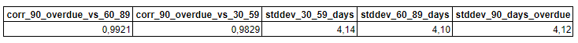
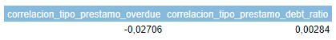

# Proyecto3_Riesgo_relativo
Propuesta de automatización del proceso de análisis utilizando técnicas avanzadas de análisis de datos, con el objetivo de mejorar la eficiencia, la precisión y la rapidez en la evaluación de las solicitudes de crédito.
# Temas
- [Introducción](#introducción)
- [Herramientas](#herramientas)
- [Lenguajes](#lenguajes)
- [Procesamiento y preparación de datos](#procesamiento-y-preparación-de-datos)
- [Visualización y Análisis de Datos](#visualización-y-análisis-de-datos)
- [Resultados](#resultados)
- [Correlación entre variables](#correlación-entre-variables)
- [Prueba de Significancia](#prueba-de-significancia) 
- [Conclusiones y recomendaciones](#conclusiones-y-recomendaciones)
- [Recursos](#recursos)

## Introduccion
El objetivo del análisis es armar un score crediticio a partir de un análisis de datos y la evaluación del riesgo relativo que pueda clasificar a los solicitantes en diferentes categorías de riesgo basadas en su probabilidad de incumplimiento. Para omar decisiones informadas sobre a quién otorgar el crédito, reduciendo así el riesgo de préstamos no reembolsables. Además, la integración de la métrica existente de pagos atrasados fortalecerá la capacidad del modelo para identificar riesgos, lo que en última instancia contribuirá a la solidez financiera y la eficiencia operativa del banco.

## Herramientas
- Google BigQuery.
- Google Colab.
- Google Looker Studio.
## Lenguajes
- SQL en BigQuery
- Python en Google Colab.
## Procesamiento y preparación de datos
1. ### Importación y Creación de Tablas en BigQuery:
- Proyecto: proyecto3
- Tablas importadas:
  - default
  - loans_Detail
  - loans_outstanding
  - user_info
2. ### Identificación y Manejo de Valores Nulos:
- ### Tabla: user_info
  - number_dependents: 943 nulls
  - last_month_salary: 7199 nulls
  En las demás tablas no se identificaron nulos.

3. ### Identificación y Manejo de Duplicados
Se identificaron duplicados en la tabla 'loans_outstanding', totalizando 304,270 registros duplicados. Lo cual nos indican que un cliente puede tener varios prestamos.

4. ### Identificar y manejar datos fuera del alcance del análisis

 
 
Se calcularon las correlaciones entre variables para analizar sus relaciones. Se encontraron correlaciones muy altas, cercanas a 1, indicando una fuerte relación lineal entre las siguientes variables:

   - more_90_days_overdue y number_times_delayed_payment_loan_60_89_days (0.9921).
   - more_90_days_overdue y number_times_delayed_payment_loan_30_59_days (0.9829).

Se observa que las desviaciones estándar son muy similares, lo que indica que los tres valores están cercanos a la media. Esto sugiere que cualquiera de las variables puede ser excluida sin perder información importante. 

 

- *Correlación entre cantidad_total_tipo_prestamo y more_90_days_overdue:*

Esta correlación es cercana a cero y negativa. Esto sugiere que no hay una relación lineal fuerte entre la cantidad total de tipos de préstamos y la cantidad de veces que un usuario ha estado más de 90 días en mora con sus préstamos. En otras palabras, el número total de tipos de préstamos que un usuario tiene no parece estar asociado de manera significativa con el número de veces que ese usuario ha estado gravemente moroso en sus préstamos.

- *Correlación entre cantidad_total_tipo_prestamo y debt_ratio:*

Esta correlación es muy cercana a cero y positiva. Indica que no hay una relación lineal significativa entre la cantidad total de tipos de préstamos y la relación deuda-ingreso (debt ratio) de los usuarios. Esto sugiere que la variedad de tipos de préstamos que un usuario tiene no está correlacionada con su relación deuda-ingreso de manera significativa.

5. ### Outliers

Para identificar los outliers en nuestras variables, primero determinamos si los datos pertenecían a una distribución normal o sesgada. Este análisis es crucial, ya que el método para detectar outliers varía según la distribución de los datos:

- *Distribución normal:* Se utilizó el Z-score para identificar outliers. El Z-score mide cuántos desvíos estándar un punto de datos se encuentra por encima o por debajo de la media.

- *Distribución sesgada:* Se utilizó el rango intercuartílico (IQR) para identificar outliers. El IQR es una medida de la dispersión estadística, y los outliers se definen como aquellos puntos que caen por debajo del primer cuartil (Q1) menos 1.5 veces el IQR o por encima del tercer cuartil (Q3) más 1.5 veces el IQR.
  
De nuestras variables analizadas, solo la variable edad presentó una distribución normal. Por lo tanto, se aplicó el Z-score para identificar los outliers en edad. 

Para el resto de las variables con distribuciones sesgadas, se utilizó el método del rango intercuartílico.

