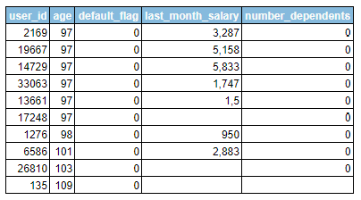

# Proyecto3_Riesgo_relativo
Propuesta de automatización del proceso de análisis utilizando técnicas avanzadas de análisis de datos, con el objetivo de mejorar la eficiencia, la precisión y la rapidez en la evaluación de las solicitudes de crédito.
# Temas
- [Introducción](#introducción)
- [Herramientas](#herramientas)
- [Lenguajes](#lenguajes)
- [Procesamiento y preparación de datos](#procesamiento-y-preparación-de-datos)
- [Visualización y Análisis de Datos](#visualización-y-análisis-de-datos)
- [Resultados](#resultados)
- [Correlación entre variables](#correlación-entre-variables)
- [Prueba de Significancia](#prueba-de-significancia) 
- [Conclusiones y recomendaciones](#conclusiones-y-recomendaciones)
- [Recursos](#recursos)

## Introduccion
El objetivo del análisis es armar un score crediticio a partir de un análisis de datos y la evaluación del riesgo relativo que pueda clasificar a los solicitantes en diferentes categorías de riesgo basadas en su probabilidad de incumplimiento. Para omar decisiones informadas sobre a quién otorgar el crédito, reduciendo así el riesgo de préstamos no reembolsables. Además, la integración de la métrica existente de pagos atrasados fortalecerá la capacidad del modelo para identificar riesgos, lo que en última instancia contribuirá a la solidez financiera y la eficiencia operativa del banco.

## Herramientas
- Google BigQuery.
- Google Colab.
- Google Looker Studio.
## Lenguajes
- SQL en BigQuery
- Python en Google Colab.
## Procesamiento y preparación de datos
1. ### Importación y Creación de Tablas en BigQuery:
- Proyecto: proyecto3
- Tablas importadas:
  - default
  - loans_Detail
  - loans_outstanding
  - user_info
2. ### Identificación y Manejo de Valores Nulos:
- ### Tabla: user_info
  - number_dependents: 943 nulls
  - last_month_salary: 7199 nulls
  En las demás tablas no se identificaron nulos.

3. ### Identificación y Manejo de Duplicados
Se identificaron duplicados en la tabla 'loans_outstanding', totalizando 304,270 registros duplicados.

4. ### Identificar y manejar datos fuera del alcance del análisis

 
 
Se calcularon las correlaciones entre variables para analizar sus relaciones. Se encontraron correlaciones muy altas, cercanas a 1, indicando una fuerte relación lineal entre las siguientes variables:

   - more_90_days_overdue y number_times_delayed_payment_loan_60_89_days (0.9921).
   - more_90_days_overdue y number_times_delayed_payment_loan_30_59_days (0.9829).

Se observa que las desviaciones estándar son muy similares, lo que indica que los tres valores están cercanos a la media. Esto sugiere que cualquiera de las variables puede ser excluida sin perder información importante. En nuestro caso, las correlaciones son altas, por lo que podemos excluir una variable considerando otros factores, como la cantidad específica de días de retraso. Por lo tanto, se ha decidido excluir la variable more_90_days_overdue.

5. ### Outliers
En este análisis, se utilizaron técnicas estadísticas para definir los outliers en la columna de edad del dataset proyecto3-428922.dataset.default_user_info_union. Aplicando el método del rango intercuartílico (IQR), se establecieron los límites superior e inferior para detectar valores atípicos. Como resultado, se identificaron 10 outliers en la distribución de edades. 
 

